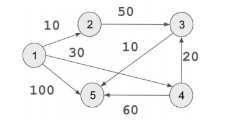

# EE599 HW6 - Graphs and Various Sorting Algorithms

Created - Spencer McDonough : 02/27/2020<br>
Last Modified - Spencer McDonough : 02/27/2020<br>
University of Southern California

## Q1 - Graph-Related Facts
1. A path in a graph is **a sequence of adjacent vertices.**
2. A simple path is **a path with no duplicate vertices.**
3. A cycle is **a path in which v<sub>1</sub> = v<sub>n</sub>.**
4. Topological sort is defined for **directed acyclic graphs (DAGs).**

## Q2 - Floyd-Warshall Algorithm
**Ref: Pseudocode**

```c++
for (int k = 0; k < weight_.size(); k++) 
{
    for (int i = 0; i < weight_.size(); ++i) 
    {
        for (int j = 0; j < weight_.size(); ++j) 
        {
            d[i][j] = std::min(d[i][j], d[i][k] + d[k][j]);
        }
    }
}
```

| k = 0 	| 1      	| 2      	| 3      	| 4      	| 5      	|
|-------	|--------	|--------	|--------	|--------	|--------	|
| 1     	| 0      	| 10     	| &infin; 	| 30     	| 100    	|
| 2     	| &infin; 	| 0      	| 50     	| &infin; 	| &infin; 	|
| 3     	| &infin; 	| &infin; 	| 0      	| &infin; 	| 10     	|
| 4     	| &infin; 	| &infin; 	| 20     	| 0      	| 60     	|
| 5     	| &infin; 	| &infin; 	| &infin; 	| &infin; 	| 0      	|

| k = 1 	| 1      	| 2      	| 3      	| 4      	| 5      	|
|-------	|--------	|--------	|--------	|--------	|--------	|
| 1     	| 0      	| 10     	| &infin; 	| 30     	| 100    	|
| 2     	| &infin; 	| 0      	| 50     	| &infin; 	| &infin; 	|
| 3     	| &infin; 	| &infin; 	| 0      	| &infin; 	| 10     	|
| 4     	| &infin; 	| &infin; 	| 20     	| 0      	| 60     	|
| 5     	| &infin; 	| &infin; 	| &infin; 	| &infin; 	| 0      	|

*Updated Distances = {}*<br>
*Note: The distance table has not been updated because, there is no route from any node back to node 1.*

| k = 2 	| 1      	| 2      	| 3      	| 4      	| 5      	|
|-------	|--------	|--------	|--------	|--------	|--------	|
| 1     	| 0      	| 10     	| *60* 	    | 30     	| 100    	|
| 2     	| &infin; 	| 0      	| 50     	| &infin; 	| &infin; 	|
| 3     	| &infin; 	| &infin; 	| 0      	| &infin; 	| 10     	|
| 4     	| &infin; 	| &infin; 	| 20     	| 0      	| 60     	|
| 5     	| &infin; 	| &infin; 	| &infin; 	| &infin; 	| 0      	|

*Updated Distances = {d[1][3]}*<br>

| k = 3 	| 1      	| 2      	| 3      	| 4      	| 5      	|
|-------	|--------	|--------	|--------	|--------	|--------	|
| 1     	| 0      	| 10     	| 60 	    | 30     	| *70*    	|
| 2     	| &infin; 	| 0      	| 50     	| &infin; 	| *60* 	    |
| 3     	| &infin; 	| &infin; 	| 0      	| &infin; 	| 10     	|
| 4     	| &infin; 	| &infin; 	| 20     	| 0      	| 60     	|
| 5     	| &infin; 	| &infin; 	| &infin; 	| &infin; 	| 0      	|

*Updated Distances = {d[1][5], d[2][5]}*<br>

| k = 4 	| 1      	| 2      	| 3      	| 4      	| 5      	|
|-------	|--------	|--------	|--------	|--------	|--------	|
| 1     	| 0      	| 10     	| *50* 	    | 30     	| 70    	|
| 2     	| &infin; 	| 0      	| 50     	| &infin; 	| 60 	    |
| 3     	| &infin; 	| &infin; 	| 0      	| &infin; 	| 10     	|
| 4     	| &infin; 	| &infin; 	| 20     	| 0      	| 60     	|
| 5     	| &infin; 	| &infin; 	| &infin; 	| &infin; 	| 0      	|

*Updated Distances = {d[1][3]}*<br>

| k = 5 	| 1      	| 2      	| 3      	| 4      	| 5      	|
|-------	|--------	|--------	|--------	|--------	|--------	|
| 1     	| 0      	| 10     	| *50* 	    | 30     	| 70    	|
| 2     	| &infin; 	| 0      	| 50     	| &infin; 	| 60 	    |
| 3     	| &infin; 	| &infin; 	| 0      	| &infin; 	| 10     	|
| 4     	| &infin; 	| &infin; 	| 20     	| 0      	| 60     	|
| 5     	| &infin; 	| &infin; 	| &infin; 	| &infin; 	| 0      	|

*Updated Distances = {}*<br>

